# analise-furnas

``` r
library(snis)
#> Loading required package: ggplot2
#> Loading required package: shiny
#> Loading required package: tidyverse
#> ── Attaching core tidyverse packages ──────────────────────── tidyverse 2.0.0 ──
#> ✔ dplyr     1.1.4     ✔ readr     2.1.5
#> ✔ forcats   1.0.1     ✔ stringr   1.6.0
#> ✔ lubridate 1.9.4     ✔ tibble    3.3.0
#> ✔ purrr     1.2.0     ✔ tidyr     1.3.1
#> ── Conflicts ────────────────────────────────────────── tidyverse_conflicts() ──
#> ✖ dplyr::filter() masks stats::filter()
#> ✖ dplyr::lag()    masks stats::lag()
#> ℹ Use the conflicted package (<http://conflicted.r-lib.org/>) to force all conflicts to become errors
#> Loading required package: tmap
#> 
#> ℹ tmap modes "plot" - "view"
#> ℹ toggle with `tmap::ttm()`
#> Modo interativo do tmap ativado: tmap_mode('view')

alago = 
  system.file("alago", "MUNICIPIOS DE ESTUDO.xlsx", package = "snis") |>
  readxl::read_xlsx()

dados2021 =
  dados_snis$"2021"$df |>
  filter(`código do município` %in% alago$Codmun)
  
dados2016 =
  dados_snis$"2016"$df |>
  filter(`código do município` %in% alago$Codmun)
```

## Mapas interativos

``` r
dados2016 |>
  mutate(
    manter =
      case_when(
        !duplicated(`código do município`) ~ TRUE,
        duplicated(`código do município`) & (`tipo de serviço` == "Água") ~ TRUE,
        duplicated(`código do município`) & (`tipo de serviço` != "Água") ~ FALSE
      )
  ) |>
  filter(manter) |>
  select(-manter)
#> # A tibble: 55 × 53
#>    `ano de referência` município     `código do município` `natureza jurídica`  
#>                  <int> <chr>                         <dbl> <fct>                
#>  1                2016 Aguanil                     3100807 Administração públic…
#>  2                2016 Alfenas                     3101607 Sociedade de economi…
#>  3                2016 Alpinópolis                 3101904 Sociedade de economi…
#>  4                2016 Alterosa                    3102001 Administração públic…
#>  5                2016 Alterosa                    3102001 Sociedade de economi…
#>  6                2016 Areado                      3104304 Sociedade de economi…
#>  7                2016 Boa Esperança               3107109 Autarquia            
#>  8                2016 Botelhos                    3108404 Sociedade de economi…
#>  9                2016 Cabo Verde                  3109501 Sociedade de economi…
#> 10                2016 Camacho                     3110400 Sociedade de economi…
#> # ℹ 45 more rows
#> # ℹ 49 more variables: `tipo de serviço` <fct>, abrangência <fct>,
#> #   `código do prestador` <int>, prestador <fct>, prestador2 <fct>,
#> #   tarifa <dbl>, micromedida <dbl>, urbanização <dbl>,
#> #   `código da região intermediária` <dbl>, `região intermediária` <fct>,
#> #   `código da região imediata` <dbl>, `região imediata` <fct>, ES006 <dbl>,
#> #   ES005 <dbl>, IN002 <dbl>, IN031 <dbl>, IN101 <dbl>, IN049 <dbl>, …
```

``` r
df = 
  dados2016 |>
  filter(`tipo de serviço` != "Esgoto") |>
  select(município, `código do município`, `score médio su`) |>
  left_join(dados2021[, c('código do município', 'score médio su')], by = 'código do município' ) |>
  `colnames<-`(c('município','código do município','su_antes','su_depois')) |>
  mutate(
    su_dif = su_depois - su_antes
  )
```

``` r
t.test(df$su_dif, mu = 0)
#> 
#>  One Sample t-test
#> 
#> data:  df$su_dif
#> t = 5.0866, df = 49, p-value = 5.745e-06
#> alternative hypothesis: true mean is not equal to 0
#> 95 percent confidence interval:
#>  0.04164301 0.09603699
#> sample estimates:
#> mean of x 
#>   0.06884
```

``` r
ibge =
    system.file("extdata", "RELATORIO_DTB_BRASIL_2024_MUNICIPIOS.ods", package = "snis") |>
    readODS::read_ods(skip = 6) |>
    select(c("Código Município Completo",
              "Região Geográfica Intermediária",
              "Nome Região Geográfica Intermediária")) |>
    `colnames<-`(c("código do município",
                   "código da região intermediária",
                   "região intermediária"))
#> New names:
#> • `` -> `...10`

df =
  df |>
  left_join(ibge, by = "código do município")
```

## Mapas interativos

``` r
mapa_interativo(dados2016, var = "score médio su", titulo = "Mapa SU 2016",  quart = FALSE)
#> 
#> ── tmap v3 code detected ───────────────────────────────────────────────────────
#> [v3->v4] `tm_polygons()`: instead of `style = "cont"`, use fill.scale =
#> `tm_scale_continuous()`.
#> ℹ Migrate the argument(s) 'palette' (rename to 'values') to
#>   'tm_scale_continuous(<HERE>)'
#> [v3->v4] `tm_polygons()`: use 'fill' for the fill color of polygons/symbols
#> (instead of 'col'), and 'col' for the outlines (instead of 'border.col').
#> [v3->v4] `tm_polygons()`: migrate the argument(s) related to the legend of the
#> visual variable `fill` namely 'title' to 'fill.legend = tm_legend(<HERE>)'
#> [v3->v4] `tm_layout()`: use `tm_title()` instead of `tm_layout(main.title = )`
#> Warning: tm_scale_intervals `label.style = "continuous"` implementation in view mode
#> work in progress
```

``` r
mapa_interativo(dados2021, var = "score médio su", titulo = "Mapa SU 2021", quart = FALSE)
#> 
#> ── tmap v3 code detected ───────────────────────────────────────────────────────
#> [v3->v4] `tm_polygons()`: instead of `style = "cont"`, use fill.scale =
#> `tm_scale_continuous()`.
#> ℹ Migrate the argument(s) 'palette' (rename to 'values') to
#>   'tm_scale_continuous(<HERE>)'
#> [v3->v4] `tm_polygons()`: migrate the argument(s) related to the legend of the
#> visual variable `fill` namely 'title' to 'fill.legend = tm_legend(<HERE>)'
#> [v3->v4] `tm_layout()`: use `tm_title()` instead of `tm_layout(main.title = )`
#> Warning: tm_scale_intervals `label.style = "continuous"` implementation in view mode
#> work in progress
```

``` r
mapa_interativo(df, var = "su_dif", titulo = "Mapa SU Diferenças", quart = FALSE)
#> 
#> ── tmap v3 code detected ───────────────────────────────────────────────────────
#> [v3->v4] `tm_polygons()`: instead of `style = "cont"`, use fill.scale =
#> `tm_scale_continuous()`.
#> ℹ Migrate the argument(s) 'palette' (rename to 'values') to
#>   'tm_scale_continuous(<HERE>)'
#> [v3->v4] `tm_polygons()`: migrate the argument(s) related to the legend of the
#> visual variable `fill` namely 'title' to 'fill.legend = tm_legend(<HERE>)'
#> [v3->v4] `tm_layout()`: use `tm_title()` instead of `tm_layout(main.title = )`
#> Warning: tm_scale_intervals `label.style = "continuous"` implementation in view mode
#> work in progress
```

## Tabelas

``` r
table_top_bottom(dados2016, top_n = 10, bottom_n = 10)
#> $Melhores
#> # A tibble: 10 × 5
#>    Município     Score_Médio Sustentabilidade Universalidade Natureza_Jurídica  
#>    <chr>               <dbl>            <dbl>          <dbl> <fct>              
#>  1 Campos Gerais       0.943            0.998          0.888 Administração públ…
#>  2 Cristais            0.915            0.884          0.946 Administração públ…
#>  3 Nepomuceno          0.892            0.869          0.914 Autarquia          
#>  4 Campo Belo          0.891            0.85           0.932 Autarquia          
#>  5 Varginha            0.843            0.798          0.888 Sociedade de econo…
#>  6 Alterosa            0.809            0.834          0.785 Administração públ…
#>  7 Formiga             0.808            0.694          0.923 Autarquia          
#>  8 Lavras              0.787            0.709          0.865 Sociedade de econo…
#>  9 Alfenas             0.766            0.691          0.842 Sociedade de econo…
#> 10 Guaxupé             0.753            0.649          0.858 Sociedade de econo…
#> 
#> $Piores
#> # A tibble: 10 × 5
#>    Município       Score_Médio Sustentabilidade Universalidade Natureza_Jurídica
#>    <chr>                 <dbl>            <dbl>          <dbl> <fct>            
#>  1 Juruaia               0.287            0.447          0.127 Sociedade de eco…
#>  2 Conceição da A…       0.302            0.435          0.17  Sociedade de eco…
#>  3 Monte Belo            0.302            0.453          0.15  Sociedade de eco…
#>  4 Alterosa              0.317            0.411          0.224 Sociedade de eco…
#>  5 Nova Resende          0.32             0.499          0.142 Sociedade de eco…
#>  6 Poço Fundo            0.329            0.54           0.118 Sociedade de eco…
#>  7 Aguanil               0.34             0.012          0.668 Administração pú…
#>  8 Campestre             0.344            0.543          0.145 Sociedade de eco…
#>  9 Areado                0.348            0.43           0.266 Sociedade de eco…
#> 10 Campos Gerais         0.348            0.518          0.178 Sociedade de eco…
```

``` r
table_top_bottom(dados2021, top_n = 10, bottom_n = 10)
#> $Melhores
#> # A tibble: 10 × 5
#>    Município     Score_Médio Sustentabilidade Universalidade Natureza_Jurídica  
#>    <chr>               <dbl>            <dbl>          <dbl> <fct>              
#>  1 Varginha            0.909            0.875          0.943 Sociedade de econo…
#>  2 Campo Belo          0.885            0.793          0.976 Autarquia          
#>  3 Lavras              0.867            0.814          0.92  Sociedade de econo…
#>  4 Alfenas             0.866            0.835          0.898 Sociedade de econo…
#>  5 Boa Esperança       0.809            0.702          0.915 Autarquia          
#>  6 Formiga             0.749            0.527          0.971 Autarquia          
#>  7 Guaxupé             0.748            0.568          0.928 Sociedade de econo…
#>  8 Alpinópolis         0.74             0.658          0.822 Sociedade de econo…
#>  9 Machado             0.737            0.501          0.974 Autarquia          
#> 10 Três Pontas         0.733            0.481          0.984 Autarquia          
#> 
#> $Piores
#> # A tibble: 10 × 5
#>    Município       Score_Médio Sustentabilidade Universalidade Natureza_Jurídica
#>    <chr>                 <dbl>            <dbl>          <dbl> <fct>            
#>  1 Alterosa              0.36             0.479          0.241 Sociedade de eco…
#>  2 Poço Fundo            0.367            0.574          0.161 Sociedade de eco…
#>  3 Candeias              0.382            0.487          0.277 Sociedade de eco…
#>  4 Conceição da A…       0.383            0.575          0.192 Sociedade de eco…
#>  5 Areado                0.384            0.523          0.244 Sociedade de eco…
#>  6 Cana Verde            0.388            0.52           0.256 Sociedade de eco…
#>  7 Juruaia               0.393            0.636          0.15  Sociedade de eco…
#>  8 Aguanil               0.4              0.014          0.785 Administração pú…
#>  9 Campos Gerais         0.416            0.569          0.262 Sociedade de eco…
#> 10 Campestre             0.444            0.675          0.213 Sociedade de eco…
```

## Gráficos score

``` r
plot_boxplot(dados2016, score_cols = "score médio su", group_cols = "prestador2", titulo = "Score por Prestador 2016")
```

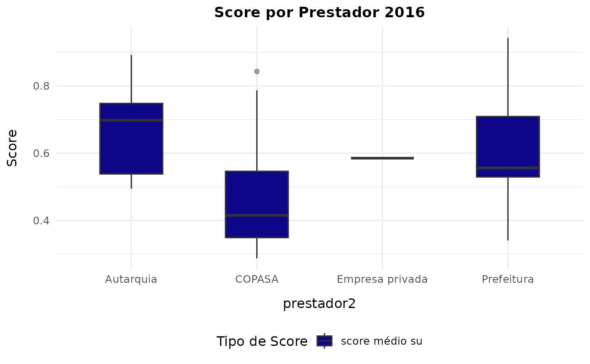

``` r
plot_boxplot(dados2016, score_cols = "score médio su", group_cols = "tipo de serviço", titulo =  "Score por Tipo de Serviço 2016")
```

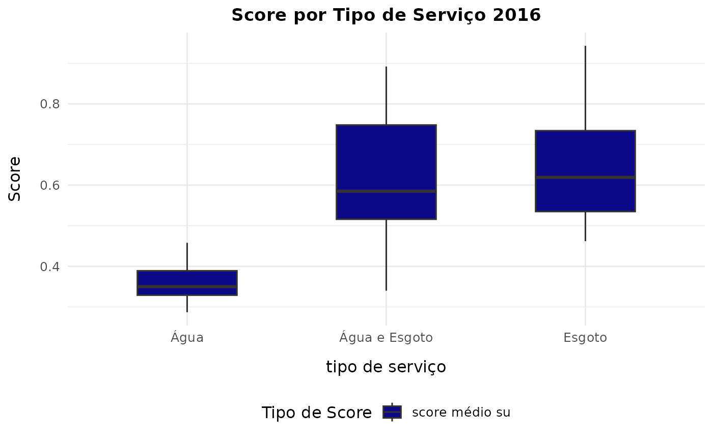

``` r
plot_boxplot(dados2021, score_cols = "score médio su", group_cols = "prestador2", titulo = "Score por Prestador 2021")
```

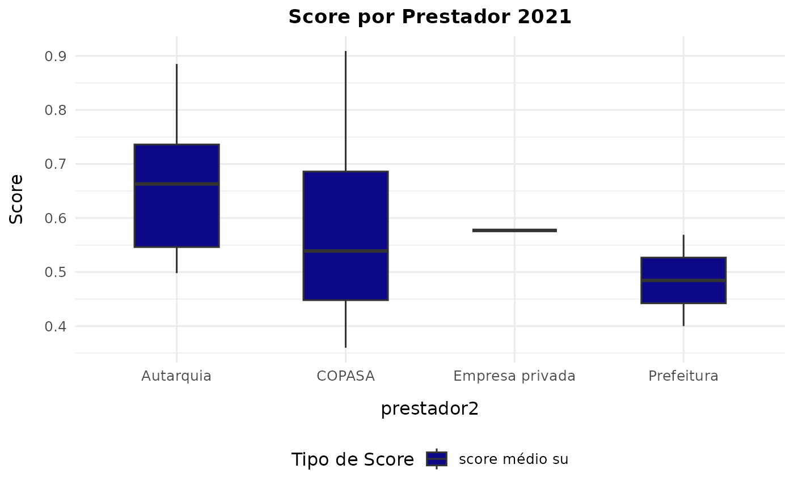

``` r
plot_boxplot(dados2021, score_cols = "score médio su", group_cols = "tipo de serviço", titulo =  "Score por Tipo de Serviço 2021")
```

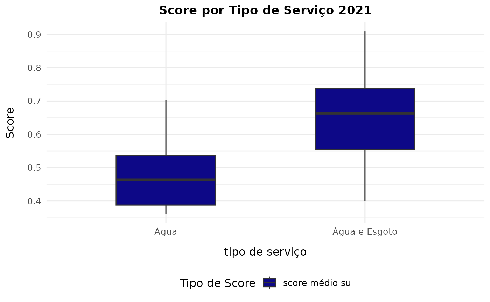

``` r
plot_median_barplot(dados2016, score_cols = "score médio su", group_cols = "natureza jurídica", titulo = "Score por Natureza Jurídica 2016")
```

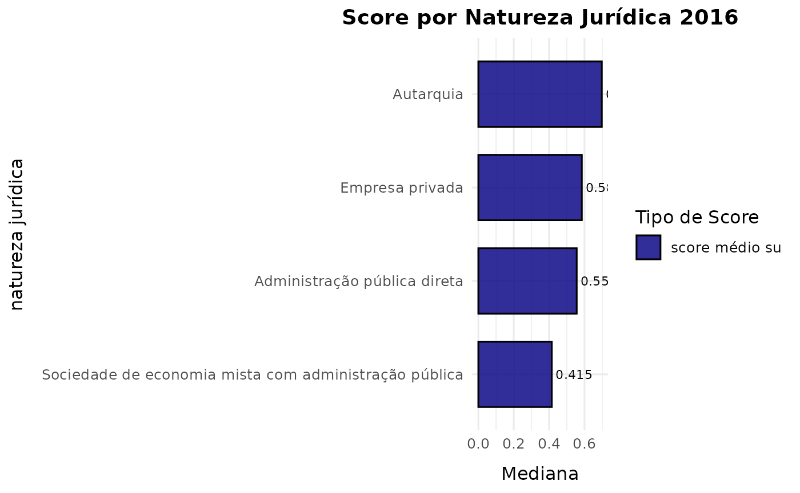

``` r
plot_median_barplot(dados2021, score_cols = "score médio su", group_cols = "natureza jurídica", titulo = "Score por Natureza Jurídica 2021")
```

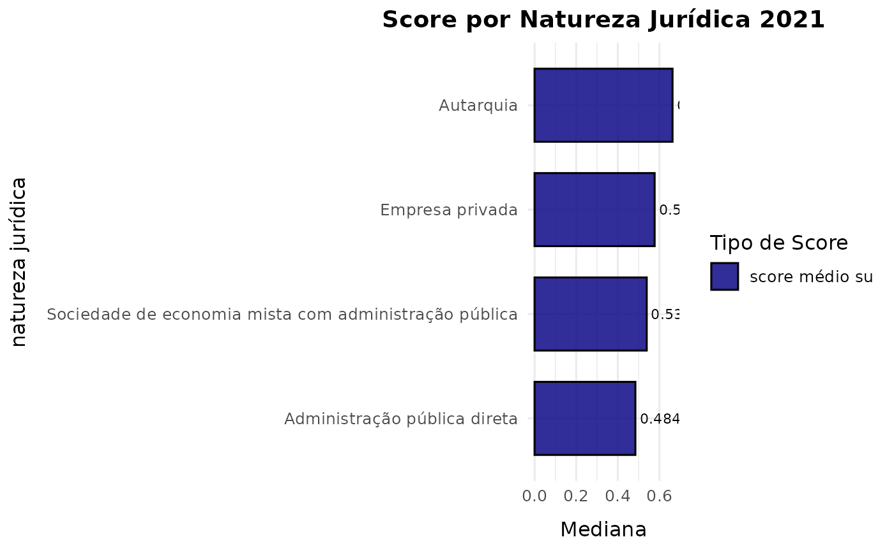

## Gráficos variáveis

``` r
plot_hist_score(dados2016, group_col = "IN023", titulo = "Densidade IN023 2016")
```

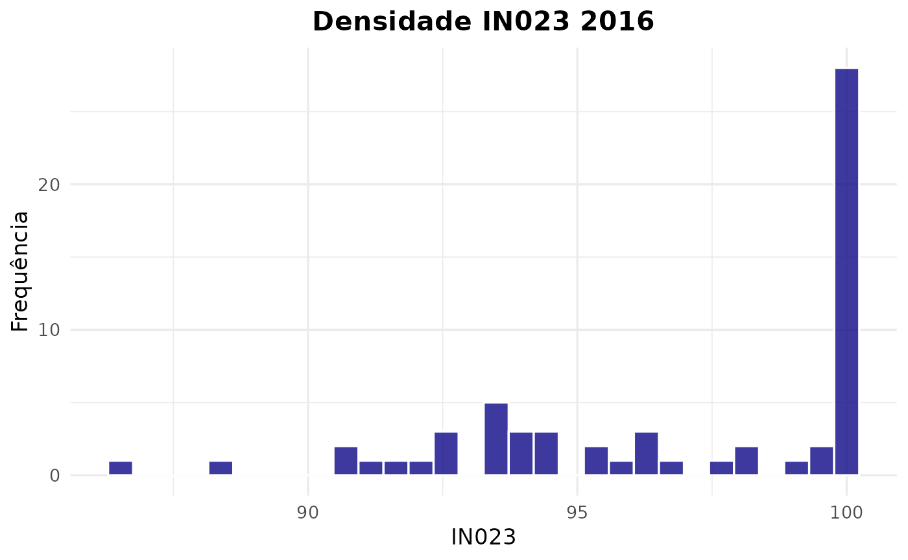

``` r
#IN023 = Índice de atendimento urbano de água
plot_hist_score(dados2021, group_col = "IN023", titulo = "Densidade IN023 2021")
```

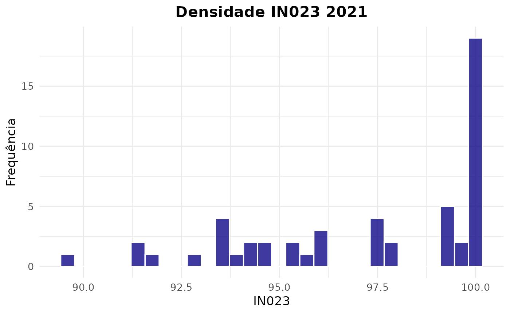

``` r
#IN055  Índice de atendimento total de água
plot_hist_score(dados2016, group_col = "IN055", titulo = "Densidade IN055 2016")
```

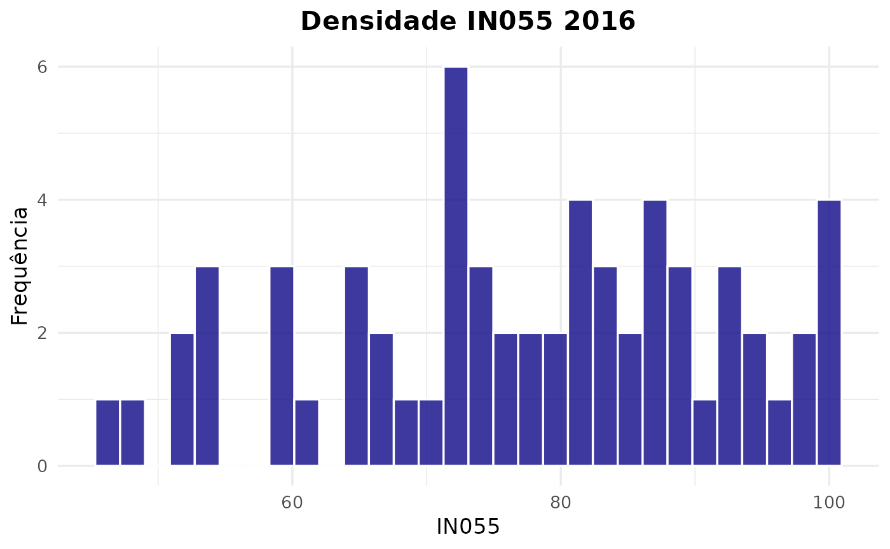

``` r
plot_density_score(dados2016, group_col = "IN055", titulo = "Densidade IN055 2016")
```

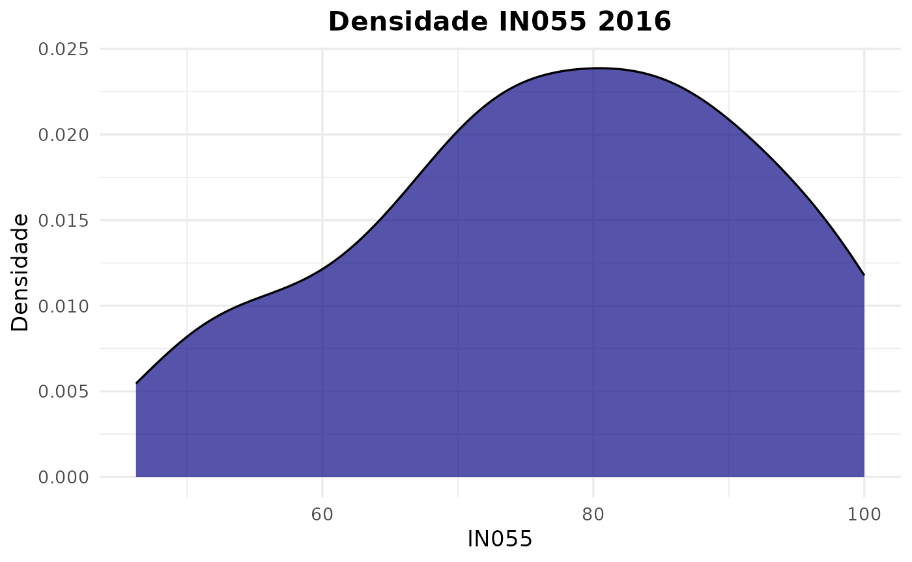

``` r
plot_hist_score(dados2021, group_col = "IN055", titulo = "Densidade IN055 2021")
```

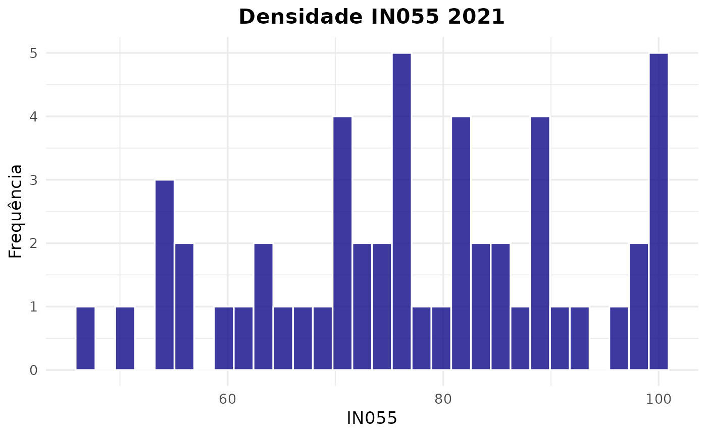

``` r
plot_density_score(dados2021, group_col = "IN055", titulo = "Densidade IN055 2021")
```

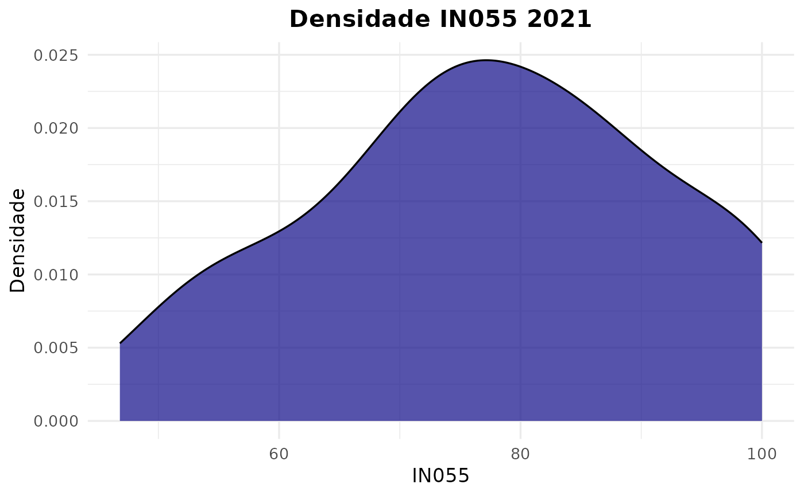

``` r
dados_comparados <- bind_rows(
  dados2016 %>%
    select(POP = POP_URB) %>%
    mutate(Ano = "2016"),
  dados2021 %>%
    select(POP = POP_URB) %>%
    mutate(Ano = "2021")
)

ggplot(dados_comparados, aes(x = POP, fill = Ano)) +
  geom_density(alpha = 0.5) +
  labs(
    title = "Densidade da População Urbana — 2016 vs 2021",
    x = "População Urbana",
    y = "Densidade"
  ) +
  scale_x_continuous(labels = scales::label_number(big.mark = ".", decimal.mark = ",")) +
  theme_minimal()
```

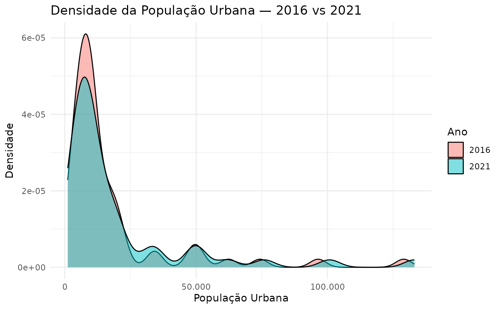
